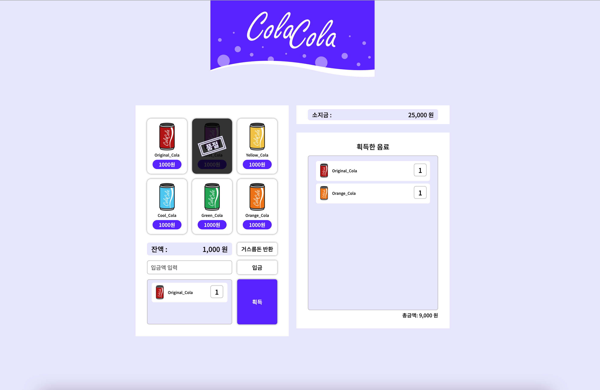
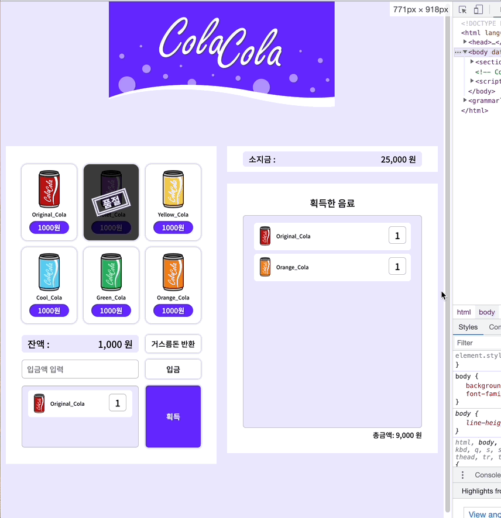

# vending-machine 구현과제

> ## vending machine 과제 설명

HTML, CSS를 사용하여 반응형 콜라 리스트 웹 페이지 제작 후
JavaScript를 이용하여 소지금에 돈을 추가하고 콜라를 선택하면 잔액이 표기되도록 한다. 선택된 콜라는 획득한 음료 영역으로 가 쌓인다.

> ## 사용된 기술 🔧

HTML, CSS  
(추후 JavaScript 코드 추가할 예정)

> ## 새로운 시도 💡

- grid 이용하기.
  - 처음엔 콜라 리스트의 배치를 강사님한테 배운 grid말고 flex로 구현했다.
    잘 적용되었다고 생각했는데, 반응형을 시도할때 `flex-wrap: wrap;`으로 설정해둬서 인지 하나씩 콜라가 떨어져내렸다. `no-wrap`으로 주자니 반응형 안했을 때 콜라가 3개씩 안묶일 것 같아서 결국 grid로 바꿔줬다. flex로 해도 반응형에 잘 대응할 수 있을 것 같은데 내가 부족해서 모르는 걸까,, 여튼 grid로 바꾸고 문제없이 반응형에도 잘 대응이 되었다.
- 컴포넌트화 하기.
  - 강사님과 한 라이브 코딩 이후 다시 만들었던 벤딩머신에서는 모듈화를 고려하지 못해서 중복된 코드를 많이 썼다. 다시 혼자 만들어보면 공통 디자인을 사용할 수 있는 컴포넌트를 생각해서 같은 클래스명을 부여해 같은 코드는 한번만 작성해주었다.
- 반응형 대응하기 - 반응형 대응을 위해 media query부분을 작성하며 느끼는 거지만 세세하게 변화하는 부분을 놓치면 안되겠다.
 > ## 새로 배운점 💡
- 강사님 코드를 거의 따라치면서 했던 연습이 많은 도움이 되었다. 내 코드를 쓰는데 자꾸 생각이 나고 익숙해서 이건 내 코드일까 아닐까 고민을 많이 했는데 이미 어떻게 동작하는 지 알고 코드를 쓴다면 이건 내가 알고 쓰는 내 코드다. 라고 생각하기로 했다. 내가 성장할 때까지 강사님 코드 또는 다른 사람이 쓴 코드를 많이 베껴보면서 구조를 파악하고 왜 이렇게 작성했는지 생각해보면서 코드 공부를 많이 해야겠다.
- 컴포넌트화를 하면서 CSS의 경제성에 대해 생각하게 되었다. 이는 결국은 디자인 시안을 보고 마크업을 어떻게 해내는가와 클래스네임 지정까지 연결된다고 생각한다. 디자인 시안을 보고 무작정 달려들어 마크업 하지말고 구조 파악을 먼저하고 컴포넌트화가 필요한 요소를 분리하자를 머릿속에 새기게 되었다!
